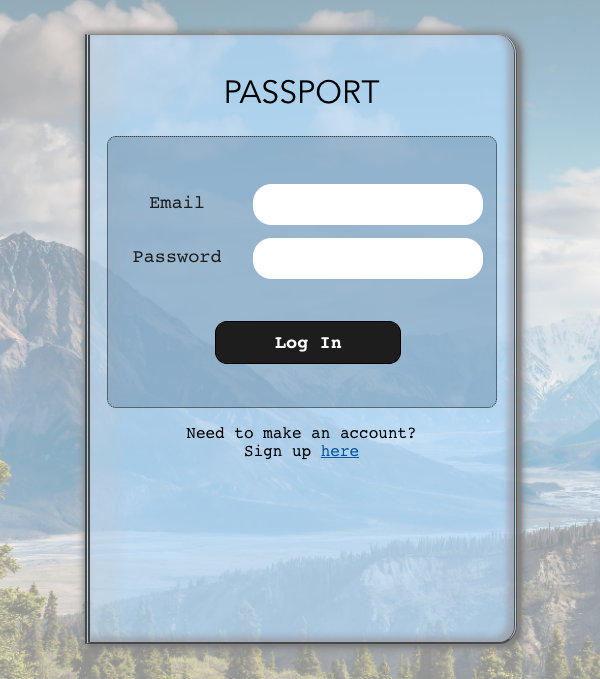
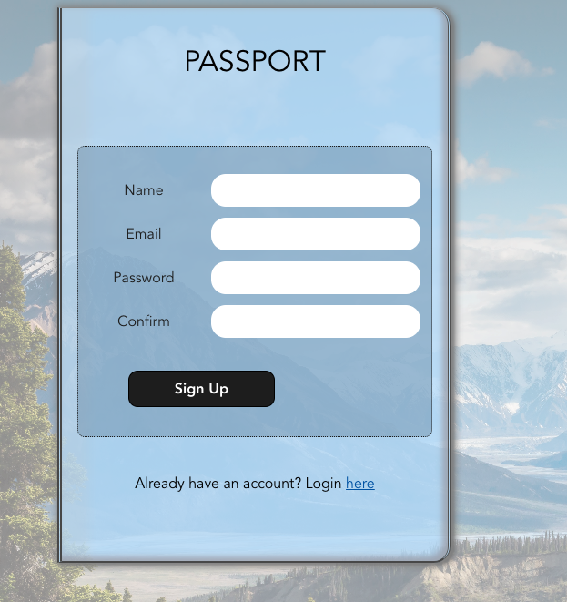
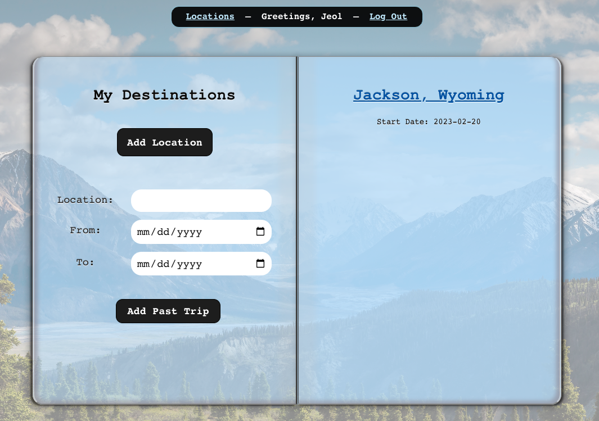
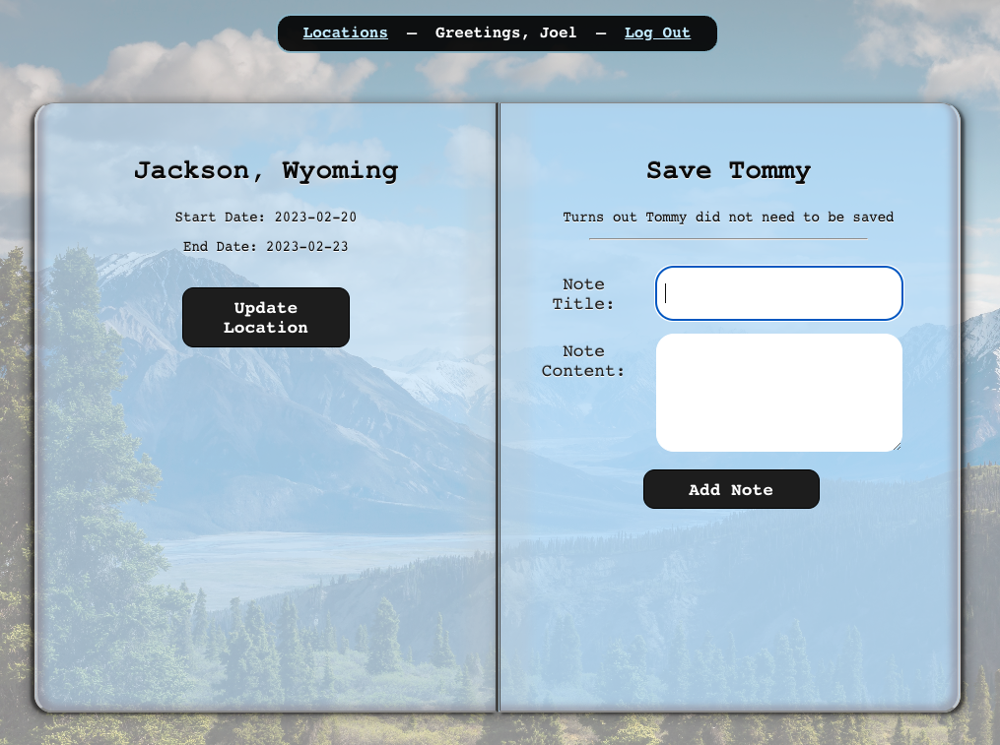
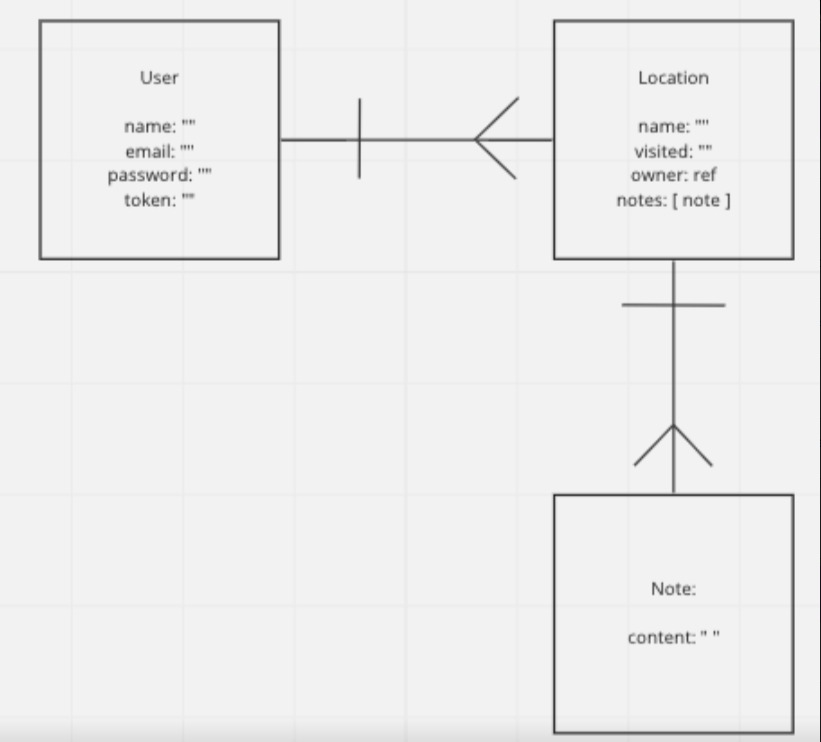

# Passport

## Description

Passport is a travel diary where users can keep track of where they traveled as well as what they did there and the memories associated with that trip

## Login Page

## Sign Up Page

## Locations Page

## Destination Detail Page

## ERD

[Slide Show](https://docs.google.com/presentation/d/1rvcr-buYfBZFSCqZEOmnaqw9-EmvTFUklsb2EMRC8g8/edit#slide=id.p)

# Technologies Used

1. Javascript

2.  HTML

3.  CSS

4.  Mongoose

5.  Mongodb

6.  Nodemon

7. Express

8. Cors

9. Passport

10. Passport-Jwt

11. Node

12. React

#  Routes 
| Name | Path | Http Verb | Purpose |
| --- | --- | --- | --- |
| Index | /api/locations | GET | Get all locations |
| Show | /api/locations/:id | GET | Get one location |
| Create | /api/locations | POST | Create one location |
| Update | /api/locations/:id | PATCH | Update one location |
| Delete | /api/locations/:id | DELETE | Delete one loation |
| Create | /api/notes | POST | Create one note |
| Update | /api/notes/:id | PATCH | Update one note |
| Delete | /api/notes/:id | DELETE | Delete one note |
| Sing Up | /api/users | POST | Create a user and token |
| Log In | /api/users/login | POST | Log in and create token |

## User Stories
- Version 2
    - AAU, I want to be able to add a wishlist
    - AAU, I want to be able to update the wishlist
    - AAU, I want to be able to delete from the wishlist
    - AAU, I want to be able to move locations from the wishlist to the locations list    
- Version 3
    - AAU, I want to see an interactive map of places I have been to
    - AAU, I want to be able to rate my locations 
    - AAU, I want to see my locations based on the rattings