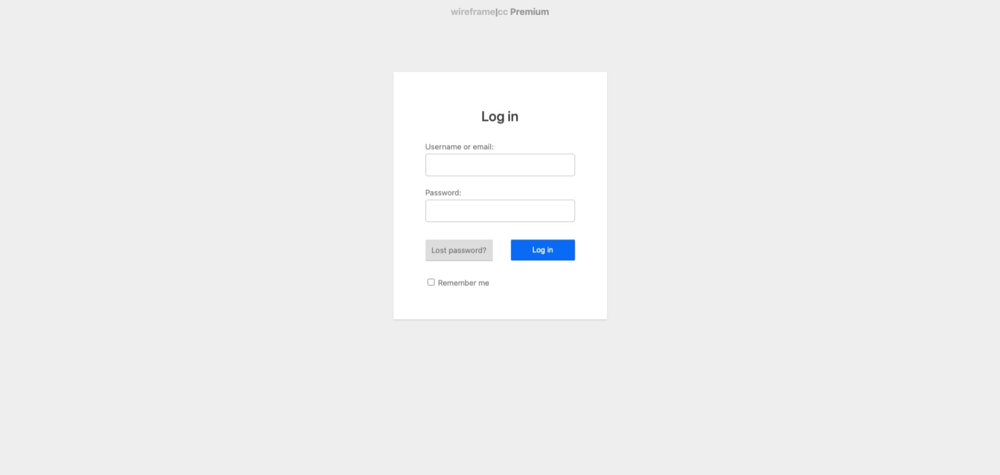
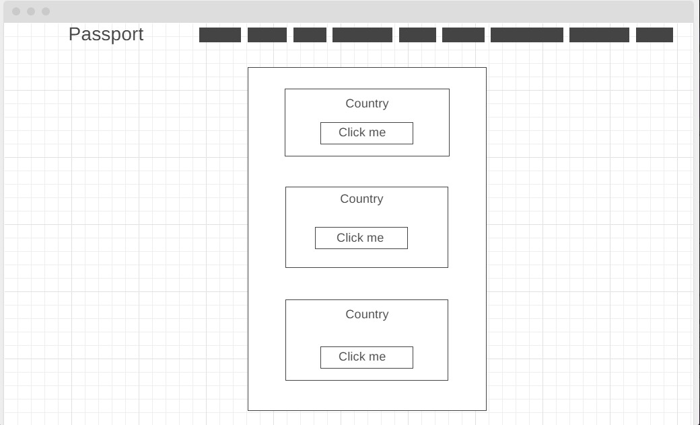

# ** TITLE **  PassPort

# Wireframe
# Login Page

--

# Signin Signup Page

--

# HomePage

--

# Country Info Page

--

# ERD

--
# image 

---
# ** Description ** 

???

# ** Technologies I used ** 

1. Javascript

2.  HTML

3.  CSS

4.  Mongoose

5.  Mongodb

6.  Nodemon

7. Express

8. Cors

9. Passport

10. Passport-Jwt

11. Node

# ** Rouets I used ** 
| Name | Path | Http Verb | Purpose |
| --- | --- | --- | --- |
| Index | /travels | GET | Display all lists |
| Show | /travels/:id | GET | Display one list |
| Create | /travels | POST | Create one list |
| Update | /travels/:id | PATCH | Update one list |
| Delete | /travels/:id | DELETE | Delete one list |

User Stories

 MVP
  1. AAU, I want to add places I have travelled to. 
  2. AAU, I want to log in, sign in and log out. 
  3. AUU, I want to add places I want to travel to. 
  4. AAU, I want to add notes to places I have been to.
  5. AAU, I want to see a list of all the places I have been to. 
  6. AAU, I want to see an interactive map of places I have been to. 
  7. AAU, I want to see the location of the pictures. 
  8. AAU, I want to CRUD on all locations and notes. 
  9. AAU, I want to rate places I have been using stars.
  10. AAU, I want to have a login/Signin Page, Landing Page, and a place detail page. 
  11. AAU, I want to have a name, a title and a description of the location.   

  Version 2
  1. AAU, I want to see the weather of the location. 

